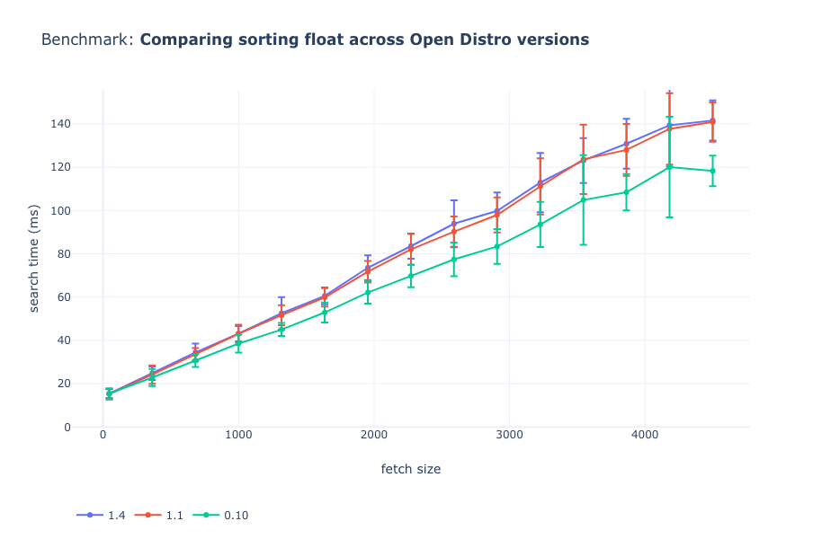
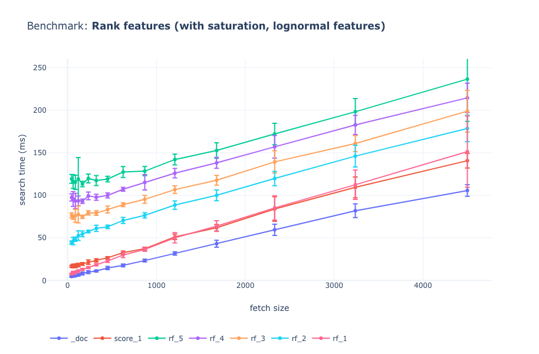

# Elasticsearch Ranking Benchmarks

A comparison of ranking performance using different index configurations and sorting approaches.

## _Note on metrics_

Even with caching off (request cache and query cache off) a lot of the performance comes from the filesystem cache used by Elasticsearch.
It's difficult to reliably test absolute performance differences offline.
These benchmarks are _indicative_ of relative performance between configurations.
Suggesting directions to explore in a production setting.

## Running benchmarks

### Run benchmarks for a config

See configuration.py for benchmark configurations.
Benchmark needs to be run at least twice to warm-up the filesystem cache.

```sh
docker-compose run --rm benchmarks bash
> python run.py --benchmark-name opendistro-versions
```

## Plotting


## Benchmarks

### Open Distro Versions

Comparing different versions of [Open Distro](https://opendistro.github.io/) ranking performance.
Sorting by a `float` field.
Changing the `fetch_size`.



### Rank Features

Comparing [rank feature queries](https://www.elastic.co/guide/en/elasticsearch/reference/7.4/query-dsl-rank-feature-query.html).
Rank feature fields populated with random data from a lognormal distribution.
Changing the `fetch_size`.
`_doc` sort is the fastest (baseline).
Sorting by one float field is approximately the same as using a single rank feature.
Each additional rank_feature added to the should clause adds additional time.


